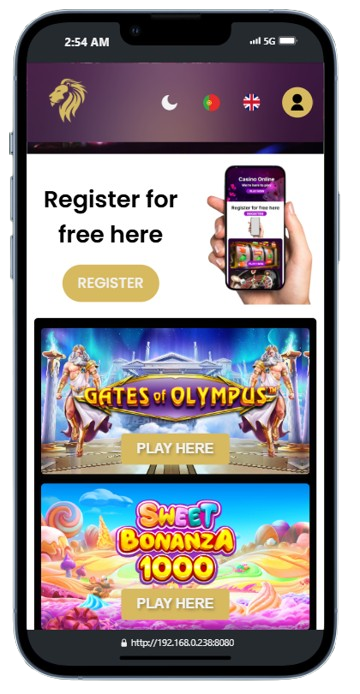
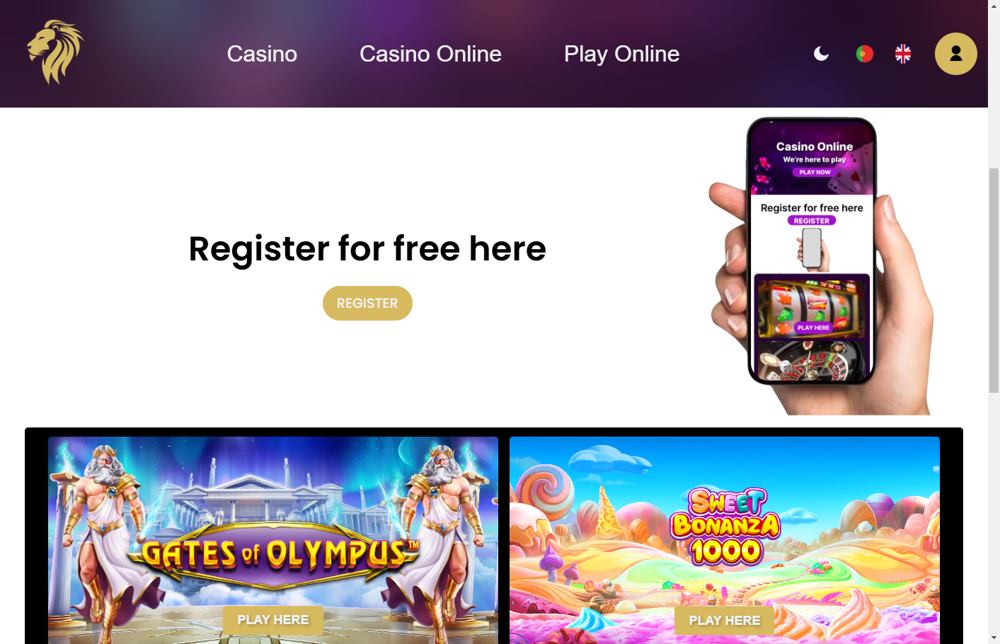

# 📌 Project: Leon211

# 📖 Description

This project is a website developed using HTML, CSS, and JavaScript. Its purpose is The purpose is to apply for a job offer by creating this website.

# 🚀 Technologies Used

  HTML5 - Website structure

  CSS3 - Styling and responsive design

  JavaScript (Vanilla/Framework) - Interactivity and dynamic features

# 📂 Project Structure

# 📁 project-name/
# ├── 📁 assets/         # Images, icons, and other static resources
# ├── 📁 css/            # CSS stylesheets
# ├── 📁 js/             # JavaScript files
# ├── 📁 pages/          # Additional pages (e.g., contact, services, etc.)
# ├── 📄 index.html      # Main page
# ├── 📄 README.md       # Project documentation
# └── 📄 .gitignore      # Files ignored by Git

# 🎨 Main Features

  ✅ Responsive design adaptable to tablet devices.
  ✅ Optimized loading of images and resources.
  ✅ Simple and intuitive navigation.
  ✅ Updating the login page.

# 🌍 Deployment and Hosting

This project can be deployed on platforms like:

GitHub Pages: https://user.github.io/project

Netlify / Vercel / Firebase Hosting

# 📄 License

This project is under the MIT license. You can use and modify it freely.

# Links Page
  - Git Hub: https://github.com/Christian-Banos/Casino-Online.git
  - Figma: https://www.figma.com/design/rN4TGzUaHAZnWDAs53fyxB/Casino-online?node-id=0-1&m=dev&t=EVyi6DBtMkrGzKlc-1
  - Trello: https://trello.com/invite/b/67c19c8aed574243939691ae/ATTIc78b30858b6c3b3177ab314815f19f3f6344DE84/casino-on-line
